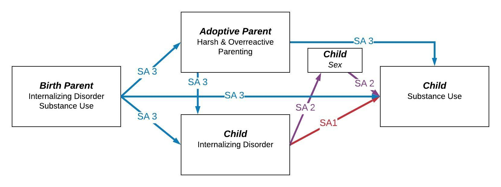

## Introduction

All slides available as a website at: https://andrewdismukes.github.io/Presentation_2020_EGDS_F32_lab/LabTalk.html

or in raw form at: 

https://github.com/andrewdismukes/Presentation_2020_EGDS_F32_lab

Twitter: adismuke
---

class: inverse, middle

## Goals
.pull-left[

 - General Feedback
 - Grantsmanship
 - Specific feedback on critical sections

]
---

### Background & Signifigance
- The *overall objective* of the proposed research is to examine the role of internalizing symptoms across childhood and into adolescence in the development of SU.
---
### So why this? 
--  
## Started with antisocial behavior and ELA.  
##but always interested in internalizing.   
##and I think there is a real problem here!   
---
### Specific Aims

To test the association between longitudinal trajectories of internalizing symptoms and SU in adolescence. 

**Hypothesis 1: Elevated internalizing symptoms across childhood will be associated with elevated SU in adolescence.**
---

### Specific Aims
To test for sex differences in the relationship between SU and internalizing symptoms across early childhood and puberty. 

**Hypothesis 2: The association between internalizing symptoms and SU will be stronger in females than males.**
---

### Specific Aims
 To test the relationship between birth parent and adoptive parent contributions to the relationship between SU and internalizing symptoms across early childhood and puberty. 
 
 **Hypothesis 3a: Elevated birth parent SU will predict increased SU in adolescence and that higher levels of birth parent internalizing symptoms will be associated with higher levels of child internalizing symptoms in adolescence.**

 **Hypothesis 3b: Early parenting practices will moderate heritable influences on childhood internalizing symptoms to increase risk for adolescent SU.**
---
### Training Plan 

---
### Conceptual Model
class: center, middle

---

